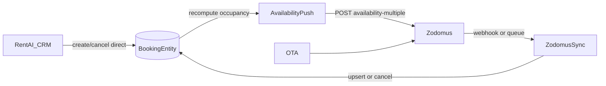

# CRM ↔ Zodomus ↔ Booking — supported flow

This document is the source of truth for what RentAI supports today.
Public Zodomus docs: https://www.zodomus.com/developers  
Full API reference requires Zodomus backoffice registration.

## Supported semantics

| Direction | What happens | Mechanism |
|-----------|--------------|-----------|
| **CRM → Booking** | Manager creates a **direct** booking in RentAI | `POST /api/v1/bookings` → `BookingEntity` (no `zodomusReservationId`) |
| **CRM → Zodomus** | Occupancy is pushed so OTAs close dates | `ZodomusAvailabilityPushService` → `POST /availability-multiple` |
| **CRM cancel (direct)** | Local status → `CANCELLED`, then reopen dates on OTAs | `PATCH /bookings/:id/status` + availability push |
| **CRM cancel (OTA)** | **Blocked** | Error `OTA_CANCEL_VIA_CHANNEL` — cancel on the OTA; Zodomus delivers status `3` |
| **Zodomus → Booking (new/modified)** | OTA reservation upserted locally | Webhook / queue / import-summary → `upsertBooking` |
| **Zodomus → Booking (cancel)** | Local status → `CANCELLED`, then availability push | Webhook/queue `reservationStatus=3` |

## What “send booking to Zodomus” means

**Today it means inventory sync (availability), not creating an OTA reservation object.**

- Direct CRM booking → RentAI is source of truth → Zodomus gets `availability: 0` for occupied nights.
- Direct CRM cancel → RentAI marks `CANCELLED` → Zodomus gets `availability: 1` again.
- OTA booking/cancel → Zodomus is source of truth → RentAI mirrors via webhook/queue.

## Not supported (public docs)

Public Reservation APIs expose only:

- `GET /reservations-queue`
- `GET /reservations`
- `GET /reservations-summary`
- `GET /reservations-cc`
- `POST /reservations-createtest` (**sandbox only**)

There is **no confirmed production endpoint** to create or cancel a guest reservation from CRM through Zodomus.
Do **not** call `reservations-createtest` in production or pretend CRM cancel writes to the channel.

If Zodomus later documents a private reservation-write API, add a gated `ZodomusReservationWriteService` behind a feature flag — do not invent request shapes.

## Manual checklist (sandbox)

1. Env: `ZODOMUS_ENABLED=true`, credentials, optional `ZODOMUS_WEBHOOK_KEY`.
2. Map property: `externalListingId` / `zodomusPropertyId` + `zodomusRoomId` on channel listing.
3. `POST /reservations-createtest` with `status=new` → webhook or `POST .../sync` → local booking appears.
4. `createtest` with `status=cancelled` (or queue status `3`) → local booking `CANCELLED`.
5. CRM: create direct booking on free dates → `POST .../push-availability` (or auto-push) → nights closed on channel.
6. CRM: cancel that **direct** booking → availability reopens.
7. CRM: try cancel OTA booking → expect `OTA_CANCEL_VIA_CHANNEL`.
8. Optional: `POST .../import-summary` on first connect to pull future reservations.
