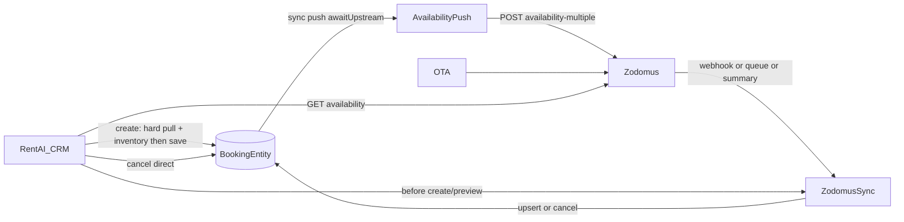

# CRM ↔ Zodomus ↔ Booking — поддерживаемый поток

Документ — источник правды по тому, что RentAI поддерживает сейчас.  
Публичные доки Zodomus: https://www.zodomus.com/developers  
Полный API Reference — после регистрации в backoffice Zodomus.

## Семантика

| Направление | Что происходит | Механизм |
|-------------|----------------|----------|
    | **CRM → Booking** | Менеджер создаёт **прямую** бронь в RentAI | `POST /api/v1/bookings` → **hard** live OTA queue pull + `GET /availability` restrictions → `BookingEntity` (без `zodomusReservationId`) → **sync** availability push; при fail Zodomus — rollback |
| **CRM → Zodomus** | Уходит занятость, чтобы OTA закрыли даты | `ZodomusAvailabilityPushService.pushAvailabilityNow({ awaitUpstream })` → `POST /availability-multiple` |
| **CRM отмена (прямая)** | Локальный статус → `CANCELLED`, затем снова открыть даты на OTA | `PATCH /bookings/:id/status` + sync availability push |
| **CRM отмена (OTA)** | **Заблокировано** | Ошибка `OTA_CANCEL_VIA_CHANNEL` — отменять на OTA; Zodomus пришлёт статус `3` |
| **Zodomus → Booking (new/modified)** | OTA-бронь upsert в CRM | Webhook / очередь / import-summary → `upsertBooking` |
| **Zodomus → Booking (cancel)** | Локальный статус → `CANCELLED`, затем availability push | Webhook/queue `reservationStatus=3` |

## Цены: Zodomus rack vs Booking.com Genius

| Что видит менеджер | Источник | Что это |
|--------------------|----------|---------|
| `otaNightlyPrices` в календаре | `GET /availability` → `rates[].price`, **Standard** из `GET /room-rates` | Channel-manager **rack** (без Genius / акций Booking) |
| `otaNightlyPricesFrom` | Тот же ARI, cheapest open non-child **без** Weekly/Monthly/LOS | Приближение Booking «от» до Genius |
| Публичная цена на Booking | Genius, −10%, mobile deals | **Не** приходит через Zodomus CM API |

Поток чтения:

1. `GET /room-rates` → `pickPrimaryRateId` (Standard) + карта имён тарифов  
2. `GET /availability` → `extractZodomusInventoryDays({ preferRateId, rateNamesById })`  
3. `GET /calendar` отдаёт `otaNightlyPrices` / `otaNightlyPricesFrom` / `otaNightlyPriceMeta`  
4. Push цены: `POST /rates` на тот же Standard `rateId`

Если Standard ≈ зачёркнутой цене на Booking, а финальная ниже — это Genius/промо, не баг sync.  
Скрипт сверки: `doc/zodomus/_tmp-price-compare-probe.mjs`.

---

## Live OTA перед прямой бронью

Перед `findBlockingOverlap` при `POST /bookings` и `GET …/conflict-preview`:

1. Если Zodomus выключен или у объекта нет external listing — no-op.
2. Иначе для каждого привязанного канала: **только** `GET /reservations-queue` (force) → upsert/cancel в локальную БД.
   - **`GET /reservations-summary` запрещён здесь** — только при онбординге (`POST …/import-summary`).
3. **Hard-fail:** любая ошибка канала (сеть / `returnCode` ≥ 400) → **502** `ZODOMUS_LIVE_PULL_FAILED` — локальную бронь **не** создаём.
4. Затем `GET /availability` на окно stay: `availability=0` / `booked>0` / `closed` / `minStay*` / CTA-CFO → **400** с reason `OTA_*` (UI conflict-preview показывает то же).
5. После успешного save: **синхронный** `pushAvailabilityNow({ awaitUpstream: true })` → `POST /availability-multiple`. Если Zodomus не принял (returnCode не 20-x / ≥400) — локальная бронь **удаляется** (rollback), ответ **502** `ZODOMUS_AVAILABILITY_PUSH_FAILED`.

Отмена прямой брони (без `zodomusReservationId`): локально `CANCELLED`, затем тот же sync `pushAvailabilityNow` (открыть ночи). При ошибке push локальная отмена уже применена; dirty-retry + 502 для UI.

## Что значит «отправить бронь в Zodomus»

**Сейчас это синхронизация инвентаря (availability), а не создание объекта гостевой брони на OTA.**

- Прямая бронь в CRM → источник правды RentAI → в Zodomus уходит `availability: 0` на занятые ночи.
- Отмена прямой брони → локально `CANCELLED` → Zodomus снова получает `availability: 1`.
- OTA-бронь / отмена → источник правды Zodomus → RentAI зеркалит через webhook/очередь.

## Не поддерживается (публичные доки)

Публичные Reservation API дают только:

- `GET /reservations-queue`
- `GET /reservations`
- `GET /reservations-summary`
- `GET /reservations-cc`
- `POST /reservations-createtest` (**только sandbox**)

**Нет подтверждённого production-эндпоинта**, чтобы из CRM создать или отменить гостевую бронь через Zodomus.  
**Не** вызывайте `reservations-createtest` в production и не делайте вид, что отмена из CRM пишет в канал.

Если Zodomus позже задокументирует private reservation-write API — добавьте gated `ZodomusReservationWriteService` за feature flag; не выдумывайте формы запросов.

## Ручной чеклист (sandbox)

1. Env: `ZODOMUS_ENABLED=true`, credentials, `ZODOMUS_WEBHOOK_KEY` (тот же ключ в backoffice Zodomus; URL webhook `…/api/v1/integrations/zodomus/webhook`).
2. Привязать объект: `externalListingId` / `zodomusPropertyId` + при необходимости `zodomusRoomId` на channel listing.
3. `POST /reservations-createtest` со `status=new` → webhook или `POST .../sync` → локальная бронь.
4. `createtest` со `status=cancelled` (или queue status `3`) → локально `CANCELLED`.
5. CRM: прямая бронь на свободные даты → `POST .../push-availability` (или auto-push) → ночи закрыты на канале.
6. CRM: отмена этой **прямой** брони → даты снова открыты.
7. CRM: попытка отменить OTA-бронь → ожидать `OTA_CANCEL_VIA_CHANNEL`.
8. Опционально: `POST .../import-summary` при первом подключении — подтянуть будущие брони.
